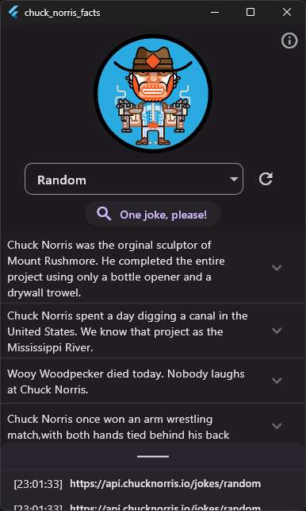
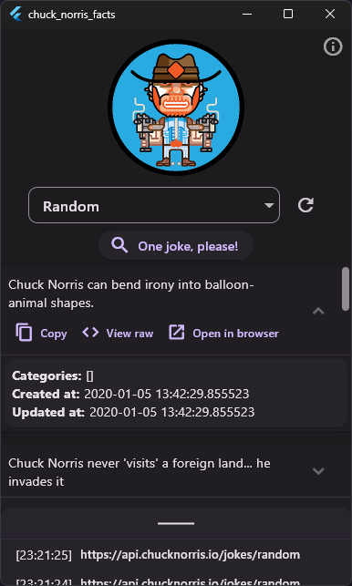
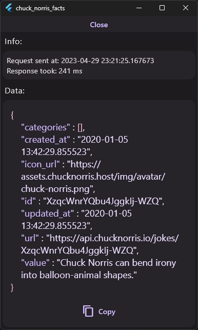
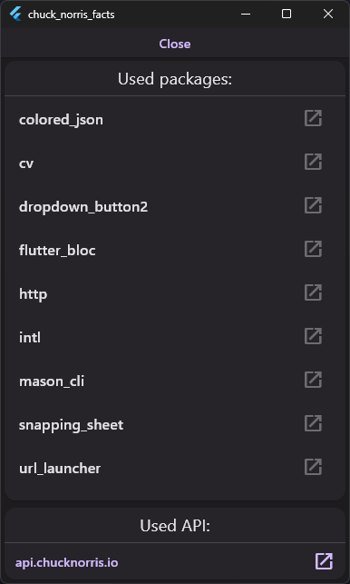

# chuck_norris_facts // Лабораторна №7 з Комп'ютерних мереж

This is a client for https://api.chucknorris.io/ :3. Doubles as assignment #7 for subject "Computer Networks".

Made using Flutter and targets Windows.

# Screenshots

